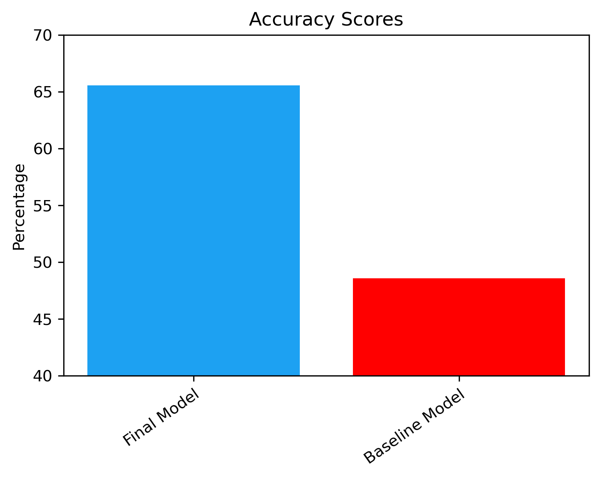
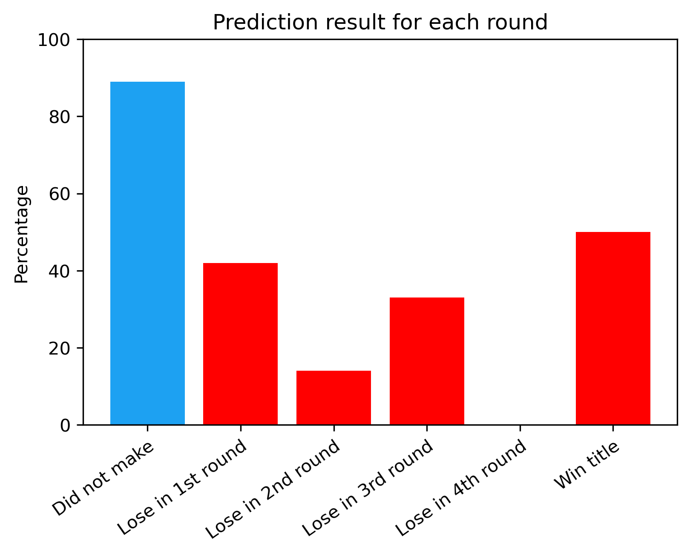

# NBA_PLAYOFF_PREDICTOR


=======
**Authors**:  Ziyuan Wang


### Overview

Basketball is one of the most popular sports around the world. NBA, national basketball assosiation, is the most popular basketball league where best basketball players from different countries cahsing the the champaionships. For this project, the goal is trying to predict playoff performance based on stats from regular season. The regular season stats are team stats and collected from last 20 years. For the stakeholder, it will be general managers from all 30 teams. No matter how good or bad your team play, this predictor is very usrful since you can use it to make better decision for team development. More deatils would be cover in Business problem part. For data, after figuring out the exact meaning for each column, I drop those columns which were obviously not related to our target. Then it's about modeling: I built some baseline models with default hyperparameters on different classifier. Then I tried different hyperparameters to get the best model with best data accurancy, recall, f1 score, which means have a better chance to identify where the team would be ended up in that season.
Accuracy for the final model 15% higher than Baseline dummy model and around 65% which looked not that good. But considering the high uncertainty for basketball, it is a pretty descent result.


### Business Problem 

For NBA team general managers, their job is to make money and let the team go as far as they can. By implement my predictor, the manger will have a higher chance to see how far this team could go for the season. For example, If they found out the team had very few chance to win the title or even few chance to make the playoff, the team can make decision to play young players more and let them earn more experience and tanking for low standing with better draft picks for next season which is good for team’s future. On the other hand, if the predictor predicts the team have a very high chance to go far in the playoffs. The general manager could make some trades or obtain some veteran players from the buyout market to make the team better.

This predictor would be very useful for team to make mid-season decisions as well as teams whose standing is from 5 to 13 in each conference. 


### Data

Data were collected through espn and basketball reference.com and saved as csv files. The regular season stats I used for modeling are all team stats and collected from last 20 seasons. There were two major types of data collected: Team average stats and Team Advanced stats. Average stats are easy to understand and calculated. Advanced Stats are a modern way to study basketball through objective analysis. It is a more in-depth way to look at a simple box score, and more accurately evaluates the skill and production of a player or team. Team season results were all input manually season by season. After merging the datasets, there are 71 feature columns in total. For the dataset, I drop the 2020 season because of covid 19. And teams didn’t play same amount of game and some of the teams with no arena attendance. 


## Results



This graph shows how good the model predicts different results of the season. It's pretty obvious that the model predict teams who will not the playoff very good. At the same time, it could predict 50% right about who will win the champ. For situation teams who lost in 1st through 4th round, the correct prediction percentage were not that high, because the match up was predicted randomly through the model. But no matter which team lost in throughout the playoff, best team has a higher chance to win the title in a seven game seires. That's the biggest reason the model had 50%correction about predicting the champion.



The best score for final model is 65.55% which was a hugh improvement from the score form baseline model(48.55%). The difference is pretty obvious as shown from the graph. Accuracy for the final model 15% higher than Baseline dummy model. 65% accurancy looked not that good, but considering the high uncertainty for basketball, for example, injury always happened randomly; shooting touch can't be always good even you are the best shooting in the world,this is a pretty descent result.

## Limitation and Future plan


For Limitation, first will be time. Even the 65% accuracy is fine but with more time and effort, I believe after more refining, it’s possible to get a better accuracy for the model. Then it’s about the data points. Since I’m using the team stats, there are only 30 rows of data for one year. Even I collected the data for last long 20 years, it’s still just 600 rows. If possible, obtaining game by game stats will be really helpful but really hard to achieve.


### Conclusion

In Conclusion, the final model had a pretty solid performance predicting how far the team will go for the season specially to predict if the team will make the playoff. The goal for every single team should be getting better, if one team can’t make the playoff for 10 straight years, which means the general manager didn’t do a good job for team development and fans will lose their patience. As a result, attendance will be low, and team can’t make money. By using this predictor will help good or bad teams to make good decision in order to make their team better in the future which is very useful to make a long wining basketball club.


## For More Information

Please review our full analysis in [our Jupyter Notebook](./NBA_PLAYOFF_PREDICTOR.ipynb) or our [presentation](./Capstone_Final_Ziyuan.pdf).

For any additional questions, please contact **Ziyuan Wang & zywang1994@gmail.com**

## Repository Structure

```
├── README.md                                                     <- The top-level README for reviewers of this project
├── NBA_PLAYOFF_PREDICTOR.ipynb                                   <- Narrative documentation of analysis in Jupyter notebook
├── Capstone_Final_Ziyuan.pdf                                     <- PDF version of project presentation
└── Images                                                        <- images folder used for project
└── Data                                                          <- data folder used for this project
└── Notebooks                                                     <- Processed_notebook folder used for this project
```


have a good day
